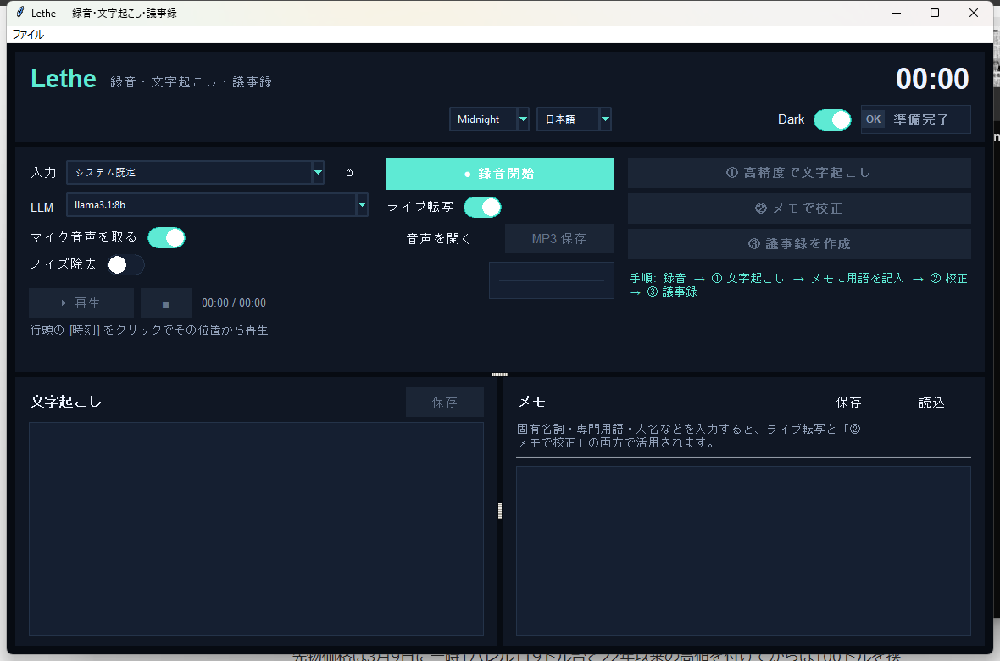

# Lethe


Lethe は、会議、通話、インタビュー、デスクトップ上の音声を文字起こしと
Markdown 議事録に変換するデスクトップアプリです。マイクや利用可能な入力
デバイスから録音し、Whisper でローカル文字起こしを行い、メモに書いた
人名や専門用語で校正し、Ollama で議事録を生成できます。音声、文字起こし、
メモは外部へ送信しません。

English documentation: [README.md](README.md)



## Motivation

会議や通話は、会議室、ヘッドセット、ビデオ会議、ブラウザ再生、ローカル
アプリなど、ばらばらの環境で発生します。Lethe は、その録音から確認までの
流れをローカルで完結させるためのツールです。必要な音声を記録し、検索できる
タイムスタンプ付き文字起こしにし、重要な単語を直し、外部サービスへ音声を
送らずに議事録を作れます。

## クイックスタート

[Task](https://taskfile.dev/) と Python 3.14.4 を入れてから実行します。

```sh
task setup
task run
```

`task setup` は必要に応じて [uv](https://docs.astral.sh/uv/) を用意し、
`uv sync --dev` で Python 環境を同期します。
`task run` は Lethe のデスクトップアプリを起動します。

モデルをダウンロードする前に、次を済ませてください。

- `task setup` で Python/uv 環境を用意する。
- LLM モデルをダウンロードする場合は、Ollama をインストールして `ollama serve` を起動する。

設定されているモデルを確認します。

```sh
task model-list
```

Whisper と LLM の 2 種類のモデルをまとめてダウンロードします。

```sh
task download-models
```

`task download-models` は次の両方をダウンロードします。

- 文字起こし用の Whisper モデル: `medium`, `large-v3`
- 校正と議事録生成用の Ollama LLM モデル: `llama3.1:8b`, `qwen2.5:7b`, `mistral:7b`

片方だけダウンロードする場合:

```sh
task download-whisper-models
task download-llm-models
```

## 主な機能

- マイク音声に加えて、Windows では PC から出ている音声を既定で録音。
- マイク音声と PC 音声の取得をセッションごとにオン/オフ可能。
- Whisper によるローカル文字起こし。ライブプレビューと高精度パスに対応。
- タイムスタンプ付き文字起こしとクリック再生。
- メモに書いた固有名詞、専門用語、人名を正しい表記として使った校正。
- Ollama による Markdown 議事録生成。
- 音声、文字起こし、メモ、メタデータをまとめたセッション保存。

## ドキュメント

- [セットアップガイド](docs/setup.ja.md)
- [使い方ガイド](docs/usage.ja.md)
- [英語版の使い方ガイド](docs/usage.md)
- [アーキテクチャとソース構成](docs/architecture.ja.md)

## For Developers

変更を送る前に `task default` を実行します。これは整形、lint、
型チェック、テストをまとめて実行します。

```sh
task default
```

## 名前について

Lethe はギリシャ神話の忘却の川から取った名前です。録音する目的は、会議の内容を頭の中に抱え続けなくて済むようにすることです。
