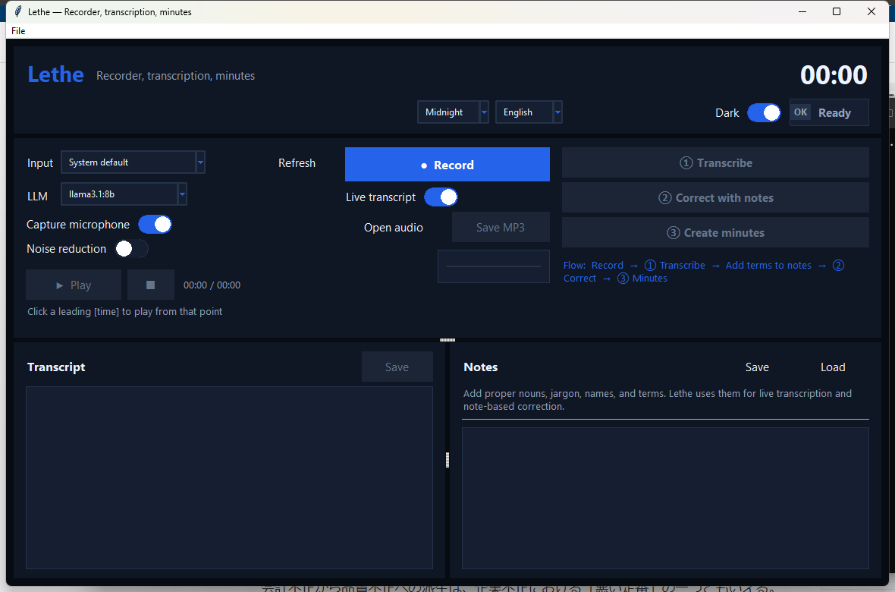

# Lethe


Lethe is a desktop app for turning meetings, calls, interviews, and recorded
desktop audio into transcripts and Markdown minutes. It records from a
microphone or another available input device, transcribes locally with Whisper,
uses your notes to correct names and domain terms, and can generate minutes
with Ollama. Audio, transcripts, and notes stay on your machine.

Japanese documentation: [README.ja.md](README.ja.md)



## Motivation

Meetings and calls often happen across a messy mix of rooms, headsets, video
calls, browser players, and local apps. Lethe is built to keep that capture and
review workflow local: record the parts you need, turn them into a searchable
timestamped transcript, fix the words that matter, and produce minutes without
sending private audio to an external service.

## Quick Start

Install [Task](https://taskfile.dev/) and Python 3.14.4, then run:

```sh
task setup
task run
```

`task setup` bootstraps [uv](https://docs.astral.sh/uv/) when needed and
syncs the Python environment with `uv sync --dev`.
`task run` starts the Lethe desktop app.

Optionally list and pre-download the configured models before first use:
Whisper `medium`, `large-v3`; Ollama `llama3.1:8b`, `qwen2.5:7b`,
`mistral:7b`.

```sh
task model-list
task download-models
```

To download one extra Ollama model by name:

```sh
task download-llm-model -- llama3.1:8b
```

## Features

- Record microphone speech or any input/loopback source your OS exposes.
- Optionally disable microphone capture when you only want to take notes.
- Run local Whisper transcription with live preview and a high-quality final
  pass.
- Edit timestamped transcripts and click timestamps to play from that point.
- Use notes as authoritative spellings for names, proper nouns, and jargon.
- Generate Markdown minutes through a local Ollama model.
- Save sessions containing audio, transcript, notes, and metadata.
- Export analysis-ready dataset folders with MP3 audio, transcript Markdown,
  notes Markdown, and a manifest path mapping.

## Documentation

- [Setup guide](docs/setup.md)
- [Usage guide](docs/usage.md)
- [Japanese usage guide](docs/usage.ja.md)
- [Architecture and source layout](docs/architecture.md)

## For Developers

Use `task default` before sending changes. It runs `task format`,
`task check`, `task typecheck`, and `task test`.

```sh
task format
task check
task typecheck
task test
```

## Name

Lethe is named after the river of forgetfulness in Greek mythology. The point
of recording a meeting is to stop carrying it in your head.
